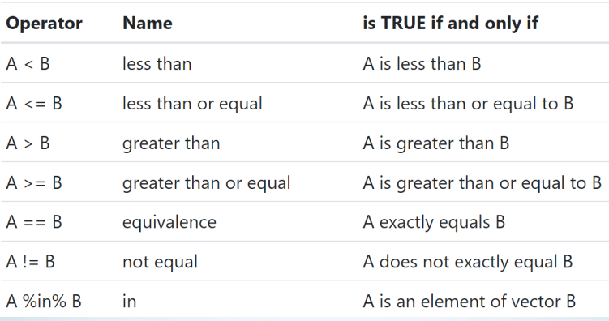
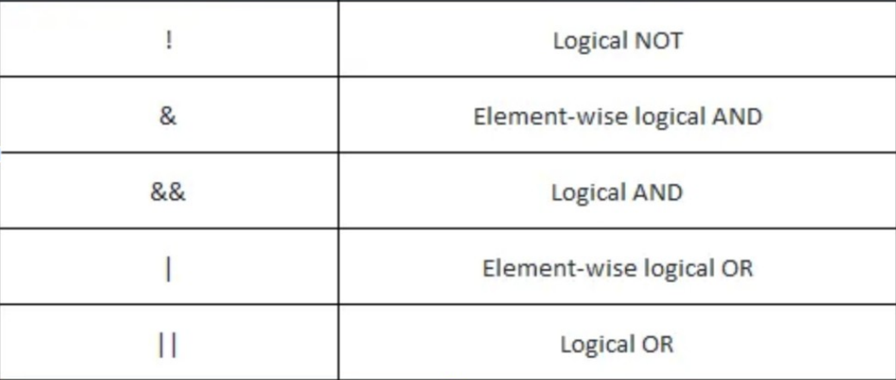
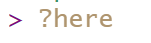
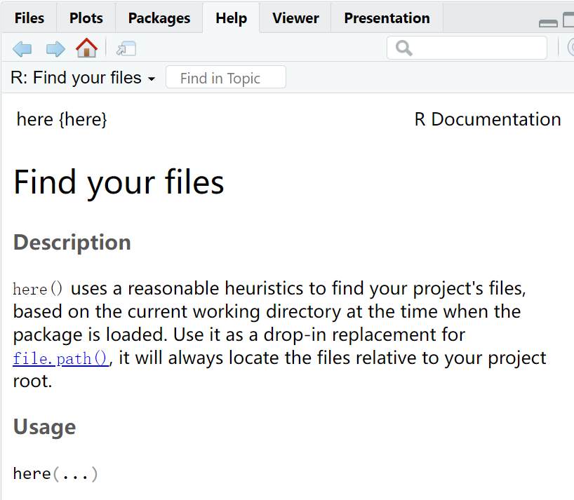

class: center, middle
<span style="font-size: 50px;">**第四章**</span> <br>
<span style="font-size: 50px;">__如何清理数据（一）__</span> <br>
<span style="font-size: 40px;">R语言编程基础</span><br>
<span style="font-size: 30px;">胡传鹏</span> <br>
<span style="font-size: 20px;"> </span> <br>
<span style="font-size: 30px;">`r Sys.Date()`</span> <br>
<span style="font-size: 20px;"> Made with Rmarkdown</span> <br>
---
# 4.1 R对象的操控
# 4.2 逻辑运算
# 4.3 函数
```{r include=FALSE}
# 读取.csv类型文件
penguin.data <- read.csv('./data/penguin/penguin_rawdata.csv',
                         header = TRUE, sep=",",
                         stringsAsFactors = FALSE)
options(width=70)#调整输出长度
```
---
# 4.1 R对象的操控
## 对象
<font size=6> partner × </font> <br>
<font size=6> object  √ </font> <br>
- <span style="font-size: 30px;"> 在R中存储的数据称为对象，R语言数据处理实际上就是不断地创建和操控这些对象。 </span> <br>

---
# 4.1 R对象的操控
## 创建对象
在R中，我们可以使用赋值操作符“<-”给对象赋值。<br>
比如：
```{r}
object <- 10
object
```
我们给对象“object”赋值为10。<br>
赋值后可以对“object”进行操作，比如：<br>
```{r}
object + 2
```
但注意此时的“object”本身并未发生改变。
```{r}
object
```

---
# 4.1 R对象的操控
## 创建对象
<font size=5>如果想要改变“object”需要对其重新进行赋值：
```{r}
object <- object + 2
```  
<br>
tips: 在RStudio中，有许多快捷键。比如赋值符号可同时按下： <br>
<br>
<center>Windows：“Alt” 和 “-” </center><br>
<center>Mac：“option” 和 “-” </center><br>

---
# 4.1 R对象的操控
## 创建对象
-   <font size=5>可以在RStudio的Tools选项里找到快捷键帮助和修改：</font><br>
<br><br>
![tools][./picture/chapter4/tools.png]

---
# 4.1 R对象的操控
## 创建对象
&emsp;&emsp; <font size=5>  变量名可以由字母、数字、_和.组成。并且变量名的第一个字符不能为数字或者特殊符号，比如 +, -, *, /, ^, !, @, &。</font> <br>  
<br>
<font size="5">
tips：<br>
&emsp;&emsp;- 对象命名区分大小写，“X” 和 “x” 表示的是不同的对象。<br>
<br>
&emsp;&emsp;- 可以使用中文，但不推荐，可能出现这样的乱码：<br>
&emsp;&emsp;鍙︿竴涓▼搴忔鍦ㄤ娇鐢ㄦ鏂囦欢锛岃繘绋嬫棤娉曡闂��。<br>
<br>
&emsp;&emsp;- 命名对象最好有不错的可读性，比如“age”就要比“x”更易读。
</font>


 <!--注：这里调整了一下去年讲的结构--> 

---
# 4.1 R对象的操控
## 对象的类型——数据结构

<br>
<p align="right"><font size=2>from http://venus.ifca.unican.es/Rintro/dataStruct.html</font></p>

---
# 4.1 R对象的操控
## 向量（Vector）
<font size=6>原子向量（atomic vector）： </font> 
<font size=5>
- 逻辑型（logical）<br>
- 整型（integer）<br>
- 双精度型（double）<br>
- 字符型（character）<br>
- 复数型（complex）<br> 
- 原始型（raw）<br>

---
# 4.1 R对象的操控
## 向量（Vector）
<font size=6>原子向量（atomic vector）： </font> 
<font size=5>
- 逻辑型（logical）<br>
```{r}
#注意需要全部大写
a <- TRUE 
b <- FALSE
print(c(a,b))
```
- 整型（integer）<br>
```{r}
a <- 3L
a
```
---
# 4.1 R对象的操控
## 向量（Vector）
<font size=6>原子向量（atomic vector）： </font> 
<font size=5>
- 双精度型（double）<br>
```{r}
a <- 3.14
a
```
- 字符型（character）<br>
```{r}
a <- "R4Psy"
a
```
---
# 4.1 R对象的操控
## 向量（Vector）
<font size=6>原子向量（atomic vector）： </font> 
<font size=5>
- 复数型（complex）<br> 
```{r}
a <- 3+4i
a
```
- 原始型（raw）<br>
```{r}
a <- charToRaw('hello')
a
```
---
# 4.1 R对象的操控
## 向量（Vector）
<font size=5>因子型向量（factor）:有顺序或者没有顺序的分类变量。</font>
<font size=5>factor(x,levels=,labels=levels,ordered=,…)</font>
```{r}
factor_01 <- factor(c("male","female","female","male"))
factor_01
mode(factor_01)
as.numeric(factor_01)
levels(factor_01)
```

---
# 4.1 R对象的操控
## 向量（Vector）
<font size=5>&emsp;&emsp;在R中，我们可以使用c()来__合并__原子向量和向量（我们可以把c看作combine）。
```{r}
a <- c(1,2,3)
b <- c(4:6)
c <- c(a,b)
c
```
```{r}
a <- c("Hello")
b <- c("World","!")
c <- c(a,b)
c
```

---
# 4.1 R对象的操控
## 向量（Vector）
<font size=5>&emsp;&emsp;当类型不同的向量进行合并时，都会变为字符型。
```{r}
x <- c(1,2,3)
y <- c(4:6)
z <- c("7")
c1 <- c(x,y)
c2 <- c(x,y,z)
c1
c2
```

---
# 4.1 R对象的操控
## 向量（Vector）
<font size=5>&emsp;&emsp;除此以外，当向量中的值的类型不同时，也存在其他的转换关系：
- character > numeric > logical
```{r}
c(1, "foo", TRUE)
c(7, TRUE, FALSE)
```
- double > integer
```{r}
c(1L, 2, pi)
```

---
# 4.1 R对象的操控
## 矩阵（Matrix）
&emsp;&emsp;仅包含同质数据的二维数据结构，可理解为许多同类型、等长度向量的组合。可以使用 matrix() 函数创建。
```{r}
matrix_01 <- matrix(1:6,nrow = 2, ncol = 3)
matrix_01
```
```{r}
cells <- c(1:6)
row_names <- c("R1", "R2", "R3")
col_names <- c("C1", "C2")
matrix_02 <- matrix(cells, nrow = 3, byrow = TRUE, dimnames = list(row_names, col_names))
matrix_02
```

---
# 4.1 R对象的操控
## 矩阵（Matrix）
<font size=5>索引：matrix[row_index, column_index]
```{r}
matrix_02
matrix_02[1,1]
matrix_02[1, ]
matrix_02[ ,1]
```

---
# 4.1 R对象的操控
## 矩阵（Matrix）
<font size=5>索引：matrix[row_index, column_index]
```{r}
matrix_02
matrix_02["R1","C1"]
matrix_02[ ,"C1"]
matrix_02["R1", ]
```

---
# 4.1 R对象的操控
## 数组（Array）
<font size=5>&emsp;&emsp;数组与矩阵类似，但是维度可以大于2。使用array()函数，该函数使用向量作为输入参数，可以使用 dim 设置数组维度。

---
# 4.1 R对象的操控
## 数组（Array）
<font size=5>array(data = NA，dim = length(data), dimnames = NULL)<br>
<br>
data：向量，数组元素。<br>
dim：数组的维度，默认是一维数组。<br>
dimnames：维度的名称，必须是个列表，默认情况下是不设置名称的。<br>
<br>
__创建一个数组↓__

---
# 4.1 R对象的操控
```{r}
dim1 <- c("A1", "A2")
dim2 <- c("B1", "B2", "B3")
dim3 <- c("C1", "C2", "C3", "C4")
z <- array(1:24, c(2, 3, 4), dimnames=list(dim1, dim2, dim3))
z
```

---
# 4.1 R对象的操控
## 数组（Array）
<font size=5>数组的索引：
```{r}
z[1,,]
z[,1,]
z[,,1]
```

---
# 4.1 R对象的操控
## 数据框（Data frame）
<font size=5>&emsp;&emsp;数据框（Data frame）可以理解成我们常说的"表格"。数据框每一列都有一个唯一的列名，长度都是相等的，同一列的数据类型需要一致，不同列的数据类型可以不一样
<div style="text-align:center">

---
# 4.1 R对象的操控
## 数据框（Data frame）
<font size=5>&emsp;&emsp;创建一个数据框：<br>
```{r}
df <-  data.frame(
  姓名  =  c("张三", "李四", "王五"),
  工号  =  c("001", "002", "003"),
  月薪  =  c(1000, 2000, 3000))
df
```

---
# 4.1 R对象的操控
## 数据框（Data frame）
<font size=5>&emsp;&emsp;创建一个数据框：<br>
```{r}
class(df$姓名)
class(df$工号)
class(df$月薪)
```
<font size=5>&emsp;&emsp;可以看到“姓名”“工号”两列的类型为字符串，“月薪”一列的类型为数值。

---
# 4.1 R对象的操控
## 数据框（Data frame）
<font size=5>&emsp;&emsp;增加一列“部门”信息：
```{r}
df$部门 <- c("运营", "技术", "编辑")
df
```
<!--<font size=5>&emsp;&emsp;增加一行信息：可以使用rbind函数，我们会在之后的函数中讲解。-->

---
# 4.1 R对象的操控
## 数据框（Data frame）
<font size=5>&emsp;&emsp;数据框的索引:
```{r}
df$部门 #使用“对象名$列名”来提取某一列
df[1,] #使用行列提取
df[df$月薪 > 1000, ]#使用逻辑向量
```
<!--引出逻辑运算-->

---
# 4.2 运算
## Outline
<font size=5>
### Numeric vector operations（数值型向量运算）<br>
### &emsp;&emsp;-with same length（等长）
### &emsp;&emsp;-with different length（不等长）
<br>
### Scalar operations（标量和标量运算）
<br>
### Numeric vector & scalar operations（数值型向量和标量运算）
<br>
### Logic operations（逻辑运算）

---
# 4.2 运算
## Numeric vector operations
<font size=5>
&emsp;&emsp;数值型向量（Numeric vector）：将若干个数值存储在一起可以用序号访问。
<br>
&emsp;&emsp;当两个数值型向量进行运算时，可能出现等长和不等长两种情况。</font>

---
# 4.2 运算
## Numeric vector operations with same length
<font size=5>
&emsp;&emsp;当两个向量等长时，运算为序号对应的元素两两运算。</font>
```{r}
x1 <- c(1,10)
x2 <- c(4,2)
x1+x2
x1-x2
x1*x2
x1/x2
```

---
# 4.2 运算
## Numeric vector operations with same length
<font size=5>
&emsp;&emsp;在我们的数据中比如：</font>

```{r}
length(penguin.data$ALEX1)#查看某一列的长度
length(penguin.data$ALEX2)
penguin.data$ALEX1+penguin.data$ALEX2
```

---
# 4.2 运算
## Numeric vector operations with different length
<font size=5>
&emsp;&emsp;当两个向量不等长时，如果其长度为倍数关系，则每次从头重复利用短的一个；如果长度没有倍数关系，则会运算到长的最后一位为止。</font>
```{r}
x1 <- c(1, 2, 3, 4)
x2 <- c(2, 4)
x1+x2
x1-x2
x1*x2
x1/x2
```

---
# 4.2 运算
## Numeric vector operations with different length
<font size=5>
&emsp;&emsp;当两个向量不等长时，如果其长度为倍数关系，则每次从头重复利用短的一个；如果长度没有倍数关系，则会运算到长的最后一位为止。</font>
```{r}
x1 <- c( 2, 3, 4)
x2 <- c(2, 4)
x1+x2

```
<font size=5>__注意warning信息__

---

# 4.2 运算
## Numeric vector operations with different length
<font size=5>
&emsp;&emsp;当两个向量不等长时，如果其长度为倍数关系，则每次从头重复利用短的一个；如果长度没有倍数关系，则会运算到长的最后一位为止。</font>
```{r}
x1 <- penguin.data$ALEX1
x2 <- penguin.data$ALEX2
x1 <- na.omit(x1)#去除x1的缺失值后，x1的长度减少，与x2不再相等
length(x1)
length(x2)
head(x1+x2,20)
```
<font size=5>__注意warning信息__

---
# 4.2 运算
## Logic operations
<font size=5>
&emsp;&emsp;逻辑型数据是R的基本数据类型之一，只有两个值TRUE和FALSE, 缺失时为NA。
</font>
<br>
<font size=5>
&emsp;&emsp;比如当我们将向量进行比较时，产生的结果就是逻辑型数据。
</font>
```{r}
x1 <- penguin.data$ALEX1
head(x1, 10)
head(x1 > 3, 10)#比较ALEX1里的数据是否大于3。大于则返回TRUE，小于或者等于则返回FALSE
```
```{r}
x2 <- penguin.data$cigs
head(x2 > 1, 10)#NA的比较返回NA
```

---
# 4.2 运算
## Logic operations
<font size=5>
&emsp;&emsp;这里有一个应用的例子：我们可以使用is.NA()判断向量的每个元素是否为NA。
</font>
```{r}
x2 <- penguin.data$cigs
head(is.na(x2),10)
```

---
# 4.2 运算
## 比较运算
<font size=5>
&emsp;&emsp;比较运算符，旨在将两个两个向量的相应元素进行比较，返回比较结果为真TRUE、假FALSE。
</font>


---
# 4.2 运算
## 比较运算
```{r}
x1 <- penguin.data$attachhome
x2 <- penguin.data$attachphone
head(x1)
head(x2)
head(x1 >= x2, 20)
head(x1 == x2, 20)
```

---
# 4.2 运算
## 比较运算
<font size=5>
&emsp;&emsp;在比较运算符中，%in%是比较特殊的，在清洗数据时我们经常会使用到它。x%in%y的运算是把向量y看成集合，依次比较x中的元素是否在集合y中。运算返回的结果是一个逻辑型向量。
</font>
```{r}
#比方说我想知道是否有1973年或者1974年出生的被试。
c(1973,1974) %in% penguin.data$age
```
<font size=5>
&emsp;&emsp;根据这个结果我知道“age”列中存在1973和1974，说明有被试是1973或者1974年出生的，这在我们之后根据条件筛选被试中可以用到。<br>
当然，我们也可以以此来判断某一列是否存在NA：
</font>
```{r}
c(NA) %in% na.omit(penguin.data$ALEX1)
c(NA) %in% penguin.data$cigs
```
---
# 4.2 运算
## 逻辑运算
<font size=5>
&emsp;&emsp;为了表达“且(and)”,“或(or)”之类的复合比较，需要使用逻辑运算把两个比较连接起来。
</font>


---
# 4.2 运算
## 逻辑运算
<font size=5>
&emsp;&emsp;"!"表示逻辑非运算符，对于向量的每个元素，会给出相反的逻辑值。
</font>
```{r}
a <- c(TRUE,FALSE)
!a
```
```{r}
a <- c(1975)
a %in% penguin.data$age
!a %in% penguin.data$age
```

---
# 4.2 运算
## 逻辑运算
<font size=5>
&emsp;&emsp;"&"表示逻辑和运算符，它将两个向量的对应元素进行组合，如果两个元素都为TRUE，则输出TRUE，否则输出False。
</font>
```{r}
a <- c(TRUE, TRUE, FALSE, FALSE)
b <- c(TRUE, FALSE, TRUE, FALSE)
a & b
```
```{r}
a <- c(1975)
b <- c(2001)
a & b %in% penguin.data$age
```
```{r}
a <- c(1975)
b <- c(1976)
a & b %in% penguin.data$age
```

---
# 4.2 运算
## 逻辑运算
<font size=5>
&emsp;&emsp;"|"表示逻辑或运算符，它将两个向量的对应元素进行组合，有TRUE则输出TRUE。
</font>
```{r}
a <- c(TRUE, FALSE, FALSE)
b <- c(FALSE, TRUE, FALSE)
a | b
```
```{r}
a <- c(1975)
b <- c(2001)
a | b %in% penguin.data$age
```

---
# 4.2 运算
## 逻辑运算
<font size=5>
&emsp;&emsp;"&&"和"||"只考虑向量的第一个元素，原理和单个的相同。
</font>
```{r}
a <- c(TRUE, FALSE, FALSE)
b <- c(FALSE, TRUE, FALSE)
a && b
```
```{r}
a <- c(TRUE, FALSE, FALSE)
b <- c(FALSE, TRUE, FALSE)
a || b
```

---
# 4.3 函数
## 什么是函数
<font size=5>
&emsp;&emsp;在R中，函数是一种用于执行特定任务或计算的代码块。函数接受输入参数，执行特定的操作，并返回结果。
</font>
<br><br>
<font size=6>
- 已有函数<br>
&emsp;&emsp;- R base; <br>
&emsp;&emsp;- R packages; <br>
&emsp;&emsp;- functions from other sources<br>
- 自定义函数
</font>

---
# 4.3 函数
## 如何调用已有函数
<font size=5>
&emsp;&emsp;1.直接调用:functions()
</font>
```{r}
#对第一位被试的ALEX求平均值
a <- penguin.data[1,2:17]#将第一位被试的ALEX得分提取出来成为新的dataframe
rowMeans(a)#对新的dataframe中的列求平均值
```
<font size=5>
&emsp;&emsp;注意，当你使用不同的包的时候，为了避免出现函数名重复导致调用错误，可以使用：R包::functions()
</font>
```{r}
library("here")#加载here包，install的R包需要library后使用
here::here()#这里第一个here是R包，第二个here是调用这个包里here函数
```

---
# 4.3 函数
## 自定义函数
<font size=5>
&emsp;&emsp;有时，我们要经常重复某一步骤，那么我们可以通过自定义函数将这些步骤打包，并调用这些自定义的函数。注意自定义函数使用前需要在当前环境自定义好。
</font>
```{r}
#定义的形式如下
my_std <- function(x) {
   (x - mean(x)) / sd(x)
 }
```
```{r}
a <- c(1,2,3,4,5)
my_std(a)
```

---
# 4.3 函数
## 当你不知道咋用一个函数时
<font size=5>
&emsp;&emsp;面对一个新的函数，我们可能并不知道它的功能和如何设置参数，这是我们可以直接在Console中求助。
</font>
<br>

{:height="20px" width="80px"}
---
class: center, middle
<span style="font-size: 60px;">Any questions?</span> <br>


